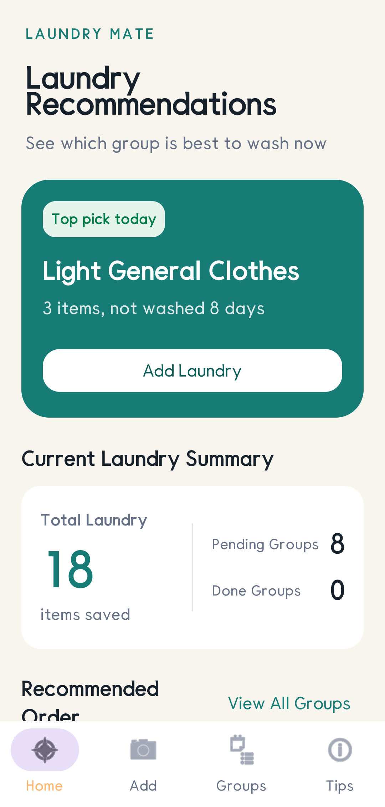
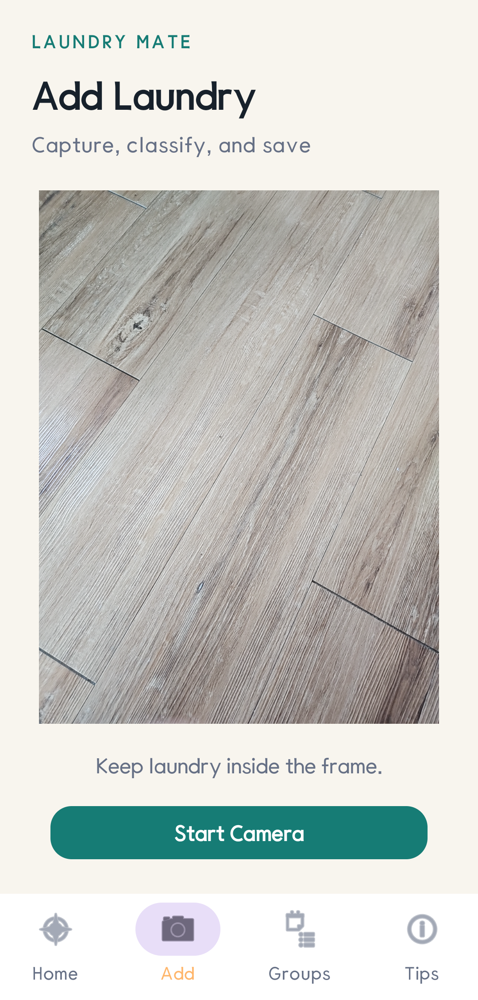
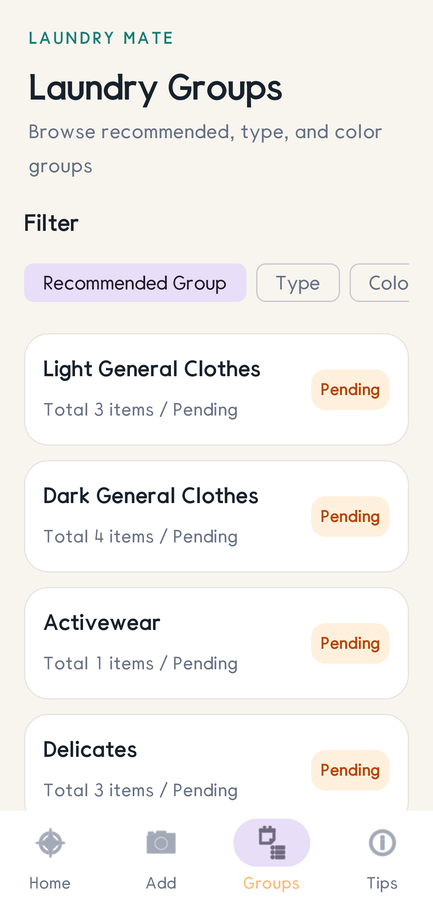
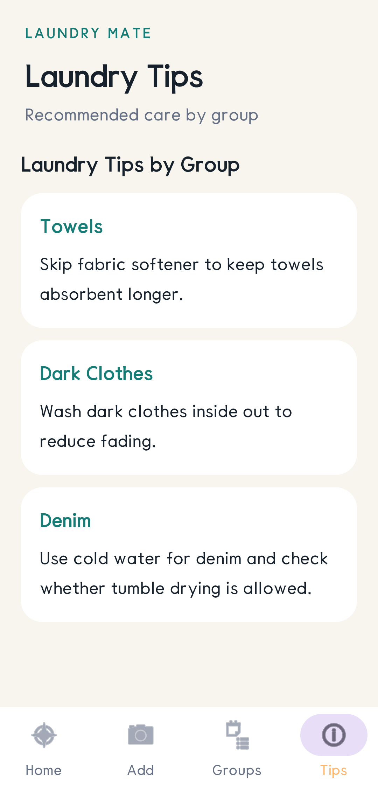
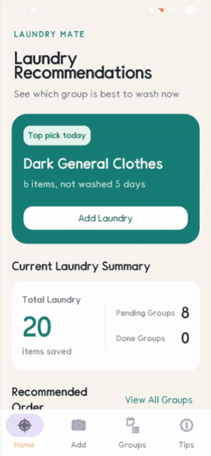

# Laundry Mate

  <a href="README-kr.md">한국어</a>
  ·
  <a href="README.md"><b>English</b></a>

Laundry Mate is an Android app that recognizes laundry from photos and helps users separate laundry loads by creating washing groups based on color and clothing type. When laundry is detected in the camera view, users can review and save the recognition result, and saved laundry items flow into group-based recommendation order and laundry tips.

Demo video: [YouTube](https://www.youtube.com/watch?v=voQA3GmAZa8)

## App Screens

<!-- TODO: Add four actual app screenshots to the paths below, then remove this comment. Recommended filenames: docs/assets/screen-home.png, docs/assets/screen-register.png, docs/assets/screen-groups.png, docs/assets/screen-tips.png -->

<table>
  <tr>
    <td></td>
    <td></td>
    <td></td>
    <td></td>
  </tr>
  <tr>
    <td align="center">Home</td>
    <td align="center">Laundry Registration</td>
    <td align="center">Laundry Groups</td>
    <td align="center">Laundry Tips</td>
  </tr>
</table>

## Laundry Detection Flow

<!-- TODO: Add a GIF showing the result confirmation modal after laundry detection to docs/assets/detection-modal.gif, then remove this comment. -->

  

1. The user starts the camera preview on the registration screen.
2. The main detection model detects laundry in the frame and maps the `top`, `bottom`, `socks`, and `towel` labels to the app's `Tops`, `Bottoms`, `Socks`, and `Towels` categories.
3. The detected region is cropped, and if it is a top or bottom, the detail model classifies its detailed type.
4. A confirmation modal shows the color analysis result and model classification result together.
5. When the user saves the item, the laundry record and cropped image are stored in the local DB and automatically assigned to a laundry group.

## Trained Models

The app includes one `YOLO26n`-based main detection model and two `YOLO26n-cls`-based detail models.

`YOLO26m`, `YOLO26s`, and `YOLO26n` were all tested for the main detection model, but the performance gap between them was not large. Therefore, the faster-to-train `YOLO26n` model was selected and trained for more epochs to improve performance.

| Model | Role | Output Classes | Training Dataset Size |
| --- | --- | --- | --- |
| Main detection model (`YOLO26n`) | Detects laundry regions and classifies app-level categories | `top`, `bottom`, `socks`, `towel` | tops/bottoms 18k, socks 8k, towels 3k |
| Top detail model (`YOLO26n-cls`) | Classifies cropped top images into detailed types | `Activewear`, `Denim`, `Hoodies`, `Shirts`, `Sweaters`, `T-shirts` | 3k per type |
| Bottom detail model (`YOLO26n-cls`) | Classifies cropped bottom images into detailed types | `Activewear`, `Chinos`, `Jeans`, `Joggers`, `Skirts`, `Slacks` | 3k per type |

## Model Evaluation Results

### Top/Bottom Detail Models

| Model | val accuracy/top1 | top5 | macro F1 | weighted F1 |
| --- | --- | --- | --- | --- |
| Top | 95.49% | 100% | 95.10% | 95.49% |
| Bottom | 92.15% | 100% | 92.11% | 92.11% |

### Main Detection Model

| class | images | objects | precision | recall | mAP50 | mAP50-95 |
| --- | ---: | ---: | ---: | ---: | ---: | ---: |
| all | 3,830 | 4,851 | 0.813 | 0.745 | 0.789 | 0.635 |
| top | 1,694 | 1,702 | 0.726 | 0.771 | 0.762 | 0.645 |
| bottom | 1,795 | 1,798 | 0.743 | 0.790 | 0.795 | 0.676 |
| socks | 158 | 1,011 | 0.942 | 0.908 | 0.960 | 0.776 |
| towel | 183 | 340 | 0.841 | 0.512 | 0.640 | 0.444 |

The towel class has a lower recall than the other classes, so missed towel detections remain the main improvement target.

## Dataset Sources

| Data Scope | Source | Purpose |
| --- | --- | --- |
| Top/bottom source images | [DeepFashion2 Dataset](https://github.com/switchablenorms/DeepFashion2) | Builds top/bottom training data with bbox and labels |
| Towel/sock source images | [Roboflow Universe](https://universe.roboflow.com/) | Builds the `towel` and `socks` classes for the main detection model |
| Additional towel images | [Open Images Dataset V7](https://storage.googleapis.com/openimages/web/download_v7.html) | Supplements the insufficient `towel` objects |

## Dataset Preparation

The training datasets were rebuilt by extracting only the classes required by the app from the raw datasets. The final datasets are managed separately as the main detection model dataset and the top/bottom detail model datasets. The top/bottom detail models were prepared first, and the source images and bbox labels for quality-checked cropped images from that process were reused as training data for the main detection model.

### RAW Dataset Selection

DeepFashion2 Dataset was selected as the base clothing dataset. DeepFashion2 includes not only shopping mall clothing images, but also images taken directly by general users, so it was considered suitable for this project, where the model needs to distinguish clothes in various states. It also provides bbox and label annotations across a large 801k-scale dataset, making it practical to convert into training data.

The towel and socks datasets mainly used public datasets from Roboflow Universe. Socks data was relatively easy to secure in sufficient quantity, but towel data from Roboflow Universe was only about 2.5k objects. Near the end of the project, additional towel data was extracted from Open Images Dataset V7, resulting in a final towel set of about 3k objects.

### Main Detection Model Dataset

The main detection model uses `YOLO26n` to find laundry in the camera view and map detected objects directly to the app's top-level categories. It was trained with four labels: `top`, `bottom`, `socks`, and `towel`. The `top` and `bottom` data were built from the source images and bbox labels of cropped images that passed CLIP-based detail-type selection. Socks and towel data from Roboflow Universe and additional towel data extracted from Open Images Dataset V7 were then added.

| App Category | Model Label | Dataset Size | Preparation Method |
| --- | --- | --- | --- |
| Tops | `top` | 18k | Source images from top crops that passed CLIP selection were merged as `top` |
| Bottoms | `bottom` | 18k | Source images from bottom crops that passed CLIP selection were merged as `bottom` |
| Socks | `socks` | 8k | Sock objects secured from Roboflow Universe were prepared as `socks` |
| Towels | `towel` | 3k | Open Images V7 extracted data was added to Roboflow Universe towel data |

### DeepFashion2 Category Split

Among the default `category_id` values in DeepFashion2, only the top and bottom categories were used, while dress-family categories were excluded.

| Usage | DeepFashion2 category_id | Source Category |
| --- | --- | --- |
| Tops | `1`, `2`, `3`, `4`, `5`, `6` | short sleeve top, long sleeve top, short sleeve outwear, long sleeve outwear, vest, sling |
| Bottoms | `7`, `8`, `9` | shorts, trousers, skirt |
| Excluded | `10`, `11`, `12`, `13` | short sleeve dress, long sleeve dress, vest dress, sling dress |

### Top/Bottom Detail Datasets

The top and bottom detail models were built as `YOLO26n-cls` training datasets by applying CLIP-based detail-class selection to images cropped from bbox annotations in the DeepFashion2 source data. The CLIP model used for this step was `openai/clip-vit-base-patch32`. CLIP was not used as a separate data source; it was used as a classification tool to divide cropped images into detailed clothing classes and select high-quality images for training. In the app, the main detection model also crops the detected region first, then passes the cropped image into the detail model.

1. Load the DeepFashion2 source images and annotations.
2. If `category_id` is `1`-`6`, classify it as a top; if it is `7`-`9`, classify it as a bottom; exclude the `10`-`13` dress family.
3. Crop the clothing region using the bbox coordinates in the annotation and save the cropped image separately.
4. Define text prompts for each target detail class, then use `openai/clip-vit-base-patch32` to calculate similarity between each cropped image and prompt.
5. Score the top detail classes (`Activewear`, `Denim`, `Hoodies`, `Shirts`, `Sweaters`, `T-shirts`) and bottom detail classes (`Activewear`, `Chinos`, `Jeans`, `Joggers`, `Skirts`, `Slacks`).
6. Select the top 3,000 cropped images by CLIP score for each detail type.
7. Save the selected cropped images into class directories and create train/validation/test splits.
8. Collect the source images and bbox labels for the selected cropped images again as `top`/`bottom` main detection training data.

## Color Type Classification

Color type classification does not use a separate trained model. Instead, it analyzes pixels in the laundry region that the main detection model stably detected, converts them to HSV values, and classifies the item as one of `White`, `Black`, `Light`, `Dark`, and `Mixed`.

1. Convert the detected bounding box to the original frame size.
2. Sample the inside of the box after insetting it by 20% horizontally and vertically to reduce background influence.
3. Uniformly sample up to 64x64 pixels from the sample region, then convert each pixel's RGB value to HSV.
4. Put each pixel into a `White`, `Black`, `Light`, or `Dark` bucket based on brightness (`V`) and saturation (`S`) thresholds.
5. If the light family (`White` + `Light`) or dark family (`Black` + `Dark`) accounts for at least 55% of all sampled pixels, choose the final type within that family.
6. Store the result as `Mixed` if neither family is sufficiently dominant or the image cannot be analyzed.

| Color Type | Classification Rule |
| --- | --- |
| `White` | The light family is dominant, and at least 55% of that family is `White` pixels |
| `Black` | The dark family is dominant, and at least 35% of that family is `Black` pixels |
| `Light` | The light family is dominant, but the `White` ratio is below the threshold |
| `Dark` | The dark family is dominant, but the `Black` ratio is below the threshold |
| `Mixed` | Neither the light family nor the dark family is at least 55% dominant |

## Laundry Group Classification

Saved laundry items are automatically grouped based on the main category, detail type, and color result. Completed groups are preserved, and if an open group with the same name already exists, new laundry items are added to that group.

| Group | Assignment Condition | Washing Method |
| --- | --- | --- |
| `Light General Clothes` | General clothes with color `White` or `Light` that do not match another special group | <!-- TODO: Add the washing method for light general clothes. --> |
| `Dark General Clothes` | General clothes with color `Black` or `Dark` that do not match another special group | Wash inside out to reduce fading. |
| `Mixed General Clothes` | General clothes with color `Mixed` or not classified as light/dark | <!-- TODO: Add the washing method for mixed general clothes. --> |
| `Activewear` | Tops or bottoms with detail type `Activewear` | <!-- TODO: Add the washing method for activewear. --> |
| `Delicates` | Clothes with detail type `Sweaters` or `Skirts` | <!-- TODO: Add the washing method for delicates. --> |
| `Light Denim` | Detail type `Denim` or `Jeans` with color `White` or `Light` | Use cold water and check whether tumble drying is allowed. |
| `Dark Denim` | Detail type `Denim` or `Jeans` with color `Black` or `Dark` | Use cold water and check whether tumble drying is allowed. |
| `Towels` | Laundry with main category `Towels` | Avoid fabric softener to preserve absorbency. |

Socks are not assigned to a fixed sock-only laundry group. They are currently assigned to general clothing groups based on color.

## App Behavior Summary

- Home: Summarizes the number of saved laundry items, pending groups, and completed groups, then recommends the best group to wash today.
- Register: Detects laundry through the camera and lets the user review the category, detail type, and color in a confirmation modal before saving.
- Groups: Shows saved laundry by recommended group, clothing type, and color.
- Tips: Provides washing tips for key groups such as towels, dark clothes, and denim.
