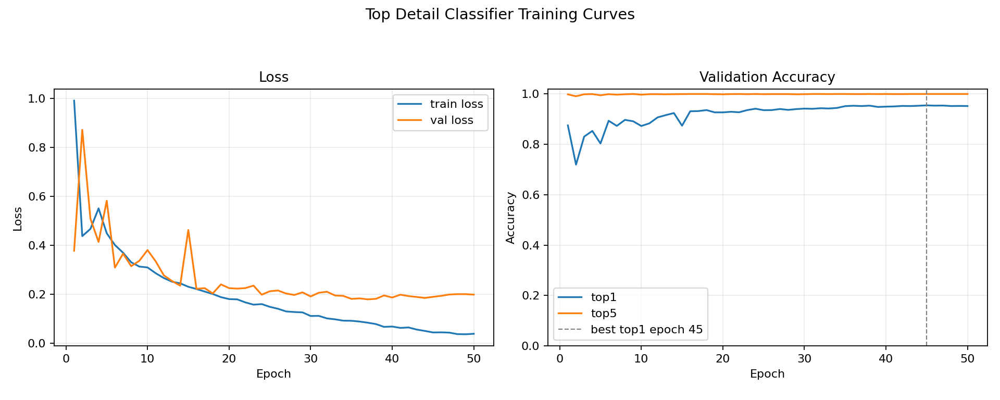
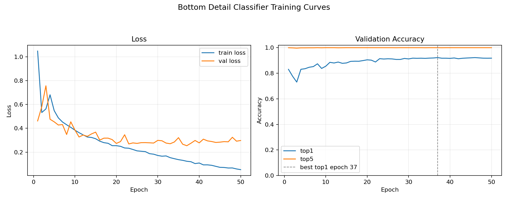
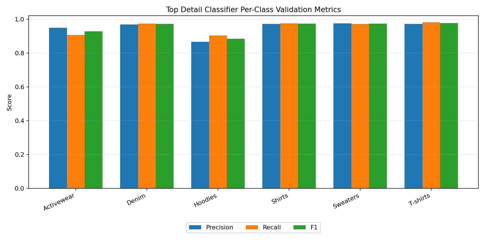
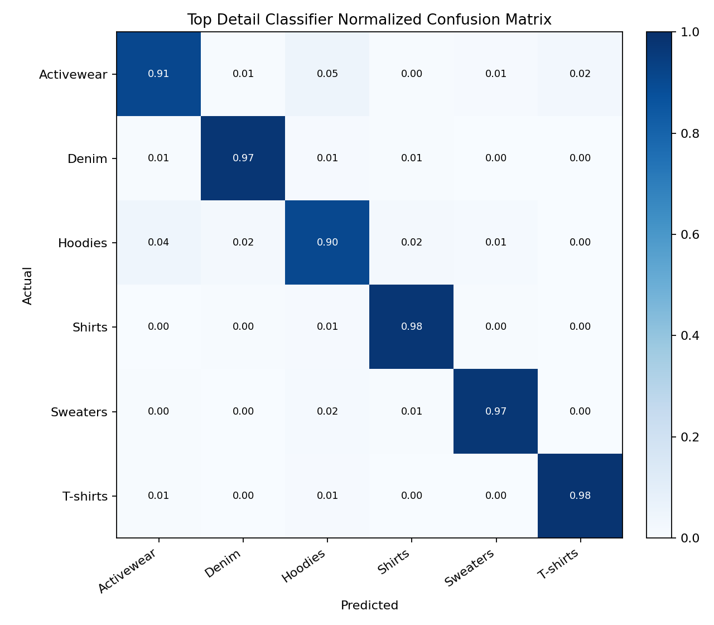
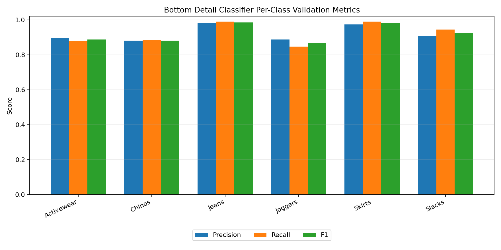
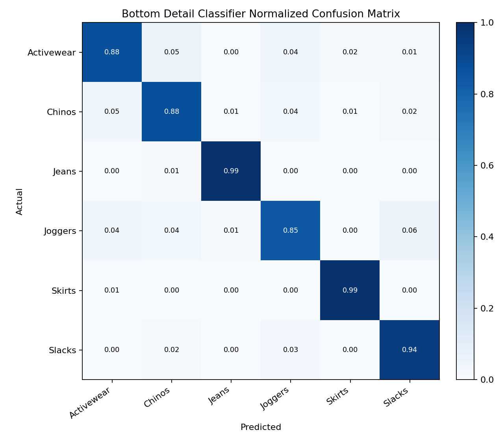

# 상의/하의 세부 분류 모델 성능 분석

## 1. 분석 대상

세부 분류 모델은 대분류 모델이 감지한 세탁물 영역을 crop한 뒤, 상의와 하의의 구체적인 종류를 분류하는 classification 모델입니다. 앱에서는 대분류 결과가 `top` 또는 `bottom`일 때만 해당 crop 이미지를 세부 분류 모델에 전달합니다.

| 항목             | 상의 세부 분류 모델 | 하의 세부 분류 모델 |
| ---------------- | ------------------- | ------------------- |
| 기반 모델        | `yolo26n-cls.pt`    | `yolo26n-cls.pt`    |
| 작업 유형        | Classification      | Classification      |
| 학습 epoch       | 50                  | 50                  |
| 입력 이미지 크기 | 224                 | 224                 |
| batch            | 64                  | 64                  |
| 평가 checkpoint  | `best.pt`           | `best.pt`           |
| 평가 split       | `val`               | `val`               |

상의 모델은 `Activewear`, `Denim`, `Hoodies`, `Shirts`, `Sweaters`, `T-shirts` 6개 클래스를 분류합니다. 하의 모델은 `Activewear`, `Chinos`, `Jeans`, `Joggers`, `Skirts`, `Slacks` 6개 클래스를 분류합니다.

## 2. 데이터셋 구성

두 모델 모두 DeepFashion2 원본 annotation의 bbox를 기준으로 crop한 이미지에 CLIP 기반 클래스 선별을 적용한 뒤, Ultralytics classification 학습 구조로 구성되었습니다. 학습/검증 split 비율은 85:15입니다.

| 모델           | train images | val images | total images |
| -------------- | -----------: | ---------: | -----------: |
| 상의 세부 분류 |       14,450 |      2,550 |       17,000 |
| 하의 세부 분류 |       15,300 |      2,700 |       18,000 |

상의 데이터셋은 대부분 클래스가 3,000장 규모로 맞춰졌지만, `Hoodies`는 2,000장으로 다른 상의 클래스보다 적습니다.

| 상의 class | train |  val | total |
| ---------- | ----: | ---: | ----: |
| Activewear | 2,550 |  450 | 3,000 |
| Denim      | 2,550 |  450 | 3,000 |
| Hoodies    | 1,700 |  300 | 2,000 |
| Shirts     | 2,550 |  450 | 3,000 |
| Sweaters   | 2,550 |  450 | 3,000 |
| T-shirts   | 2,550 |  450 | 3,000 |

하의 데이터셋은 6개 클래스가 모두 3,000장씩 균형 있게 구성되었습니다.

| 하의 class | train |  val | total |
| ---------- | ----: | ---: | ----: |
| Activewear | 2,550 |  450 | 3,000 |
| Chinos     | 2,550 |  450 | 3,000 |
| Jeans      | 2,550 |  450 | 3,000 |
| Joggers    | 2,550 |  450 | 3,000 |
| Skirts     | 2,550 |  450 | 3,000 |
| Slacks     | 2,550 |  450 | 3,000 |

## 3. 전체 성능 비교

두 모델 모두 top5 accuracy가 1.0000으로 측정되어, 정답 클래스는 거의 항상 상위 후보 안에 들어갑니다. 다만 앱에서는 최종적으로 하나의 세부 타입을 저장하므로 top1 accuracy와 클래스별 혼동을 함께 봐야 합니다.

| 모델           | top1 accuracy | top5 accuracy | macro precision | macro recall | macro F1 |
| -------------- | ------------: | ------------: | --------------: | -----------: | -------: |
| 상의 세부 분류 |        0.9549 |        1.0000 |          0.9503 |       0.9520 |   0.9510 |
| 하의 세부 분류 |        0.9215 |        1.0000 |          0.9210 |       0.9215 |   0.9211 |

상의 모델은 top1 95.49%, macro F1 95.10%로 매우 안정적인 성능을 보입니다. 하의 모델도 top1 92.15%, macro F1 92.11%로 사용 가능한 수준이지만, 상의 모델보다 낮습니다. 이는 하의 클래스들이 crop 이미지에서 서로 비슷하게 보이는 경우가 많기 때문으로 해석할 수 있습니다.

## 4. 학습 곡선 해석

### 4.1 상의 모델

  

상의 모델은 50 epoch 동안 train loss와 val loss가 안정적으로 낮아졌고, top1 accuracy도 높은 수준으로 수렴했습니다.

|              epoch | train loss | val loss |   top1 |   top5 |
| -----------------: | ---------: | -------: | -----: | -----: |
|                  1 |     0.9906 |   0.3779 | 0.8753 | 0.9984 |
|                 25 |     0.1491 |   0.2129 | 0.9357 | 0.9992 |
|                 50 |     0.0391 |   0.1991 | 0.9522 | 1.0000 |
|     best top1 (45) |     0.0446 |   0.1900 | 0.9549 | 1.0000 |
| best val loss (37) |     0.0845 |   0.1796 | 0.9522 | 0.9996 |

best top1은 45 epoch에서 0.9549로 기록되었습니다. 37 epoch에서 val loss가 가장 낮았고, 이후에도 top1은 비슷한 수준을 유지했습니다. 후반부에 train loss가 계속 낮아지는 동안 val loss가 크게 무너지지는 않아, 현재 checkpoint는 안정적인 배포 후보로 볼 수 있습니다.

### 4.2 하의 모델

  

하의 모델은 37 epoch에서 best top1과 best val loss를 동시에 기록했습니다. 50 epoch까지 학습을 이어가면 train loss는 계속 낮아지지만 val loss는 증가하고 top1은 소폭 하락합니다.

|              epoch | train loss | val loss |   top1 |   top5 |
| -----------------: | ---------: | -------: | -----: | -----: |
|                  1 |     1.0479 |   0.4618 | 0.8307 | 0.9996 |
|                 25 |     0.2110 |   0.2737 | 0.9133 | 1.0000 |
|                 50 |     0.0536 |   0.2978 | 0.9182 | 1.0000 |
|     best top1 (37) |     0.1238 |   0.2541 | 0.9226 | 1.0000 |
| best val loss (37) |     0.1238 |   0.2541 | 0.9226 | 1.0000 |

하의 모델은 상의 모델보다 클래스 간 경계가 더 모호하고, 37 epoch 이후에는 약한 과적합 신호가 보입니다. 최종 검증 리포트는 `best.pt`를 기준으로 재평가되었기 때문에 top1 0.9215 수준을 유지합니다.

## 5. 상의 세부 분류 성능

  

상의 모델은 대부분의 클래스에서 F1 0.92 이상을 기록했습니다. `T-shirts`, `Shirts`, `Sweaters`, `Denim`은 매우 안정적이고, `Hoodies`가 상대적으로 가장 약합니다.

| class      | support | precision | recall |     F1 |
| ---------- | ------: | --------: | -----: | -----: |
| Activewear |     450 |    0.9488 | 0.9067 | 0.9273 |
| Denim      |     450 |    0.9690 | 0.9733 | 0.9712 |
| Hoodies    |     300 |    0.8658 | 0.9033 | 0.8842 |
| Shirts     |     450 |    0.9712 | 0.9756 | 0.9734 |
| Sweaters   |     450 |    0.9754 | 0.9711 | 0.9733 |
| T-shirts   |     450 |    0.9714 | 0.9822 | 0.9768 |

  

상의 모델에서 가장 큰 혼동은 `Activewear`와 `Hoodies` 사이에서 발생했습니다.

| actual     | predicted  | count |
| ---------- | ---------- | ----: |
| Activewear | Hoodies    |    22 |
| Hoodies    | Activewear |    13 |
| Activewear | T-shirts   |    11 |
| Hoodies    | Denim      |     7 |
| Sweaters   | Hoodies    |     7 |
| Hoodies    | Shirts     |     5 |
| Shirts     | Hoodies    |     5 |
| Activewear | Sweaters   |     4 |

`Hoodies`는 support도 300장으로 다른 주요 클래스보다 적고, 후드가 명확히 보이지 않거나 운동복처럼 보이는 crop에서는 `Activewear`와 섞일 가능성이 있습니다. 앱에서는 `Hoodies` 예측 confidence가 낮을 때 사용자가 쉽게 수정할 수 있도록 확인 흐름을 유지하는 것이 좋습니다.

## 6. 하의 세부 분류 성능

  

하의 모델은 `Jeans`와 `Skirts`가 매우 강하고, `Joggers`, `Chinos`, `Activewear`가 상대적으로 약합니다. 특히 바지류끼리는 crop 이미지에서 실루엣과 재질 단서가 비슷해 혼동이 더 자주 발생합니다.

| class      | support | precision | recall |     F1 |
| ---------- | ------: | --------: | -----: | -----: |
| Activewear |     450 |    0.8957 | 0.8778 | 0.8866 |
| Chinos     |     450 |    0.8803 | 0.8822 | 0.8812 |
| Jeans      |     450 |    0.9802 | 0.9889 | 0.9845 |
| Joggers    |     450 |    0.8881 | 0.8467 | 0.8669 |
| Skirts     |     450 |    0.9737 | 0.9889 | 0.9813 |
| Slacks     |     450 |    0.9081 | 0.9444 | 0.9259 |

  

하의 모델의 주요 혼동은 `Joggers`, `Slacks`, `Chinos`, `Activewear` 사이에 집중되어 있습니다.

| actual     | predicted  | count |
| ---------- | ---------- | ----: |
| Joggers    | Slacks     |    27 |
| Activewear | Chinos     |    24 |
| Chinos     | Activewear |    21 |
| Joggers    | Activewear |    20 |
| Activewear | Joggers    |    18 |
| Joggers    | Chinos     |    17 |
| Chinos     | Joggers    |    16 |
| Slacks     | Joggers    |    13 |

`Jeans`와 `Skirts`는 형태와 재질 단서가 비교적 뚜렷해 높은 성능을 보입니다. 반면 `Joggers`, `Chinos`, `Slacks`, `Activewear`는 바지형 crop 안에서 경계가 모호하기 때문에 추가 개선 시 hard example 검토가 가장 효과적일 가능성이 큽니다.

## 7. 앱 적용 관점

두 세부 분류 모델은 모두 앱의 자동 입력 보조 기능으로 사용하기에 충분한 수준입니다. 상의 모델은 top1 95% 이상으로 안정적이고, 하의 모델도 top1 92% 수준으로 대부분의 경우 세부 타입 후보를 올바르게 제공합니다.

다만 세부 분류 결과는 사용자가 최종 확인하는 값으로 다루는 것이 안전합니다. 특히 다음 경우에는 확인 UI에서 수정 가능성을 전제로 하는 것이 좋습니다.

- 상의가 `Hoodies` 또는 `Activewear`로 예측되었지만 confidence가 낮은 경우
- 하의가 `Joggers`, `Chinos`, `Slacks`, `Activewear` 중 하나로 예측된 경우
- crop 이미지가 옷 전체를 충분히 포함하지 못하거나, 접힘/그림자 때문에 실루엣이 흐려진 경우

다음 개선 사이클에서는 상의보다 하의 모델을 우선 개선하는 편이 효율적입니다. 하의 모델에서는 `Joggers`와 `Chinos` 주변 혼동을 줄이는 것이 전체 체감 성능 개선에 가장 직접적으로 연결됩니다.

## 8. 결론

상의 세부 분류 모델은 top1 0.9549, macro F1 0.9510으로 매우 안정적인 성능을 보입니다. 남은 약점은 `Hoodies`이며, 주로 `Activewear`와 혼동됩니다.

하의 세부 분류 모델은 top1 0.9215, macro F1 0.9211로 사용 가능한 수준이지만 상의보다 낮습니다. `Jeans`와 `Skirts`는 강하지만, `Joggers`, `Chinos`, `Activewear`, `Slacks` 사이의 혼동이 주요 개선 대상입니다.

따라서 현재 모델은 앱에 적용 가능한 세부 분류 후보이며, 후속 개선은 하의 바지류 hard case를 중심으로 진행하는 것이 가장 효과적입니다.
