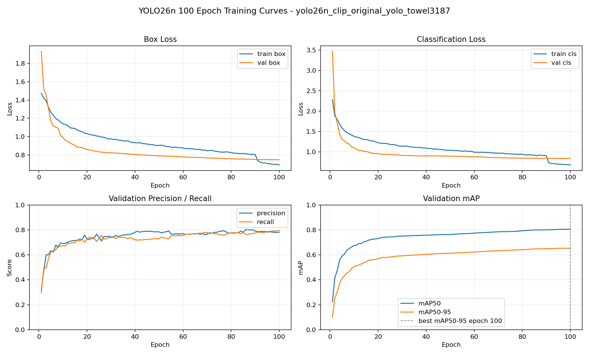
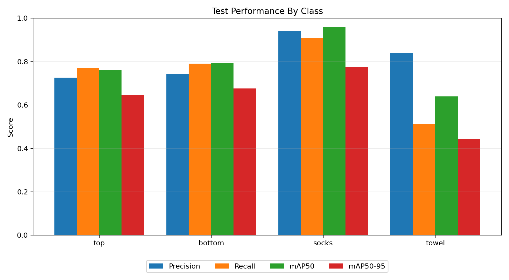

# 대분류 모델 성능 분석

## 1. 분석 대상

대분류 모델은 앱에서 세탁물을 먼저 찾고, 감지된 물체를 `top`, `bottom`, `socks`, `towel` 네 가지 상위 카테고리로 분류하는 detector입니다. 이후 상의와 하의는 별도 소분류 모델로 세부 종류를 다시 판단하므로, 이 모델의 핵심 역할은 세탁물 영역을 안정적으로 찾고 앱의 기본 카테고리로 넘겨주는 것입니다.

| 항목             | 내용                              |
| ---------------- | --------------------------------- |
| 기반 모델        | `yolo26n.pt`                      |
| 작업 유형        | Object detection                  |
| 출력 클래스      | `top`, `bottom`, `socks`, `towel` |
| 학습 epoch       | 100                               |
| 입력 이미지 크기 | 640                               |
| 평가 checkpoint  | `best.pt`                         |
| 최종 평가 split  | 학습에 사용하지 않은 `test` split |

## 2. 데이터셋 구성

이번 학습 데이터셋은 앱에서 직접 사용하는 4개 대분류 라벨에 맞춰 구성되었습니다. 상의와 하의는 CLIP으로 선별한 crop provenance의 원본 이미지와 bbox label을 활용했고, 양말과 수건은 별도 원천 데이터에서 확보한 이미지를 추가했습니다.

전체 데이터셋 규모는 이미지 38,253장, object 46,851개입니다.

| split | images | objects |
| ----- | -----: | ------: |
| train | 30,600 |  37,417 |
| val   |  3,823 |   4,583 |
| test  |  3,830 |   4,851 |
| total | 38,253 |  46,851 |

클래스별 object 수를 보면 `top`과 `bottom`은 충분히 큰 규모로 구성되어 있고, `socks`도 object 수는 비교적 많습니다. 반면 `towel`은 전체 데이터 중 가장 작은 비중을 차지하므로, 모델 성능에서도 가장 불안정할 가능성이 높은 클래스입니다.

| split |    top | bottom | socks | towel |  total |
| ----- | -----: | -----: | ----: | ----: | -----: |
| train | 13,601 | 14,405 | 6,877 | 2,534 | 37,417 |
| val   |  1,697 |  1,797 |   776 |   313 |  4,583 |
| test  |  1,702 |  1,798 | 1,011 |   340 |  4,851 |

## 3. 학습 곡선 해석

  

100 epoch 동안 box loss와 classification loss는 전반적으로 안정적으로 감소했습니다. 특히 검증 mAP가 마지막 epoch까지 완만하게 상승했기 때문에, 100 epoch 학습은 과도한 반복이라기보다 성능을 실제로 끌어올린 구간으로 해석할 수 있습니다.

| epoch | precision | recall | mAP50 | mAP50-95 | train box loss | val box loss | train cls loss | val cls loss |
| ----: | --------: | -----: | ----: | -------: | -------------: | -----------: | -------------: | -----------: |
|     1 |     0.317 |  0.296 | 0.225 |    0.101 |          1.474 |        1.931 |          2.286 |        3.471 |
|    50 |     0.784 |  0.729 | 0.763 |    0.612 |          0.907 |        0.790 |          1.042 |        0.894 |
|   100 |     0.781 |  0.794 | 0.806 |    0.654 |          0.693 |        0.748 |          0.681 |        0.841 |

주요 관찰점은 다음과 같습니다.

- mAP50-95 기준 최고 성능은 100 epoch에서 기록되었습니다.
- 50 epoch 이후에도 mAP50과 mAP50-95가 계속 개선되어, 추가 학습의 효과가 있었습니다.
- precision은 50 epoch와 100 epoch가 비슷하지만, recall은 0.729에서 0.794로 개선되었습니다.
- 후반부에 검증 성능이 급격히 무너지는 현상은 보이지 않습니다.

## 4. 최종 테스트 성능

최종 성능은 학습과 검증에 사용하지 않은 `test` split에서 다시 평가했습니다. 전체 기준으로 precision 0.813, recall 0.745, mAP50 0.789, mAP50-95 0.635를 기록했습니다.

| class  | images | objects | precision | recall | mAP50 | mAP50-95 |
| ------ | -----: | ------: | --------: | -----: | ----: | -------: |
| all    |  3,830 |   4,851 |     0.813 |  0.745 | 0.789 |    0.635 |
| top    |  1,694 |   1,702 |     0.726 |  0.771 | 0.762 |    0.645 |
| bottom |  1,795 |   1,798 |     0.743 |  0.790 | 0.795 |    0.676 |
| socks  |    158 |   1,011 |     0.942 |  0.908 | 0.960 |    0.776 |
| towel  |    183 |     340 |     0.841 |  0.512 | 0.640 |    0.444 |

  

## 5. 클래스별 해석

`socks`는 가장 안정적인 클래스입니다. Precision 0.942, recall 0.908, mAP50 0.960으로 네 클래스 중 가장 높은 성능을 보였습니다. 양말은 object 수가 많고 형태적 특징도 비교적 뚜렷해 모델이 잘 학습한 것으로 볼 수 있습니다.

`bottom`은 균형이 좋은 클래스입니다. Precision 0.743, recall 0.790, mAP50-95 0.676으로 전체 클래스 중 실사용 관점에서 가장 무난한 성능을 보입니다.

`top`은 `bottom`과 비슷한 수준이지만 precision이 조금 낮습니다. 실제 앱에서는 상의를 잘 찾는 편이지만, 일부 다른 물체를 상의로 잘못 잡을 가능성이 하의보다 조금 더 높다고 해석할 수 있습니다.

`towel`은 가장 큰 개선 대상입니다. Precision 0.841은 나쁘지 않지만 recall이 0.512에 그쳐, 감지한 수건은 비교적 정확하더라도 실제 수건을 놓치는 경우가 많습니다. 이는 수건 데이터가 다른 클래스보다 적고, 접히거나 펼쳐진 형태가 다양해 학습 난도가 높기 때문일 가능성이 큽니다.

## 6. 앱 적용 관점

이번 100 epoch 모델은 4개 앱 대분류를 처리하는 detector로서 배포 후보로 볼 수 있습니다. 전체 mAP50은 0.789이고, `top`, `bottom`, `socks`는 앱의 1차 분류 흐름에 사용할 수 있는 수준의 성능을 보입니다.

다만 `towel`은 별도 대응이 필요합니다. 현재 수건 클래스는 precision보다 recall 문제가 크기 때문에, 앱에서 수건 누락이 사용자 경험에 중요하다면 다음 개선을 우선 검토해야 합니다.

- 수건 데이터 추가 수집 및 품질 검수
- 접힌 수건, 펼친 수건, 배경과 색이 비슷한 수건 등 hard case 보강
- 수건 클래스에 대한 confidence threshold 별도 조정
- 수건 오탐보다 미탐이 더 큰 문제인지 앱 사용 흐름에서 확인

## 7. 결론

`yolo26n_clip_original_yolo_towel3187` 모델은 기존 4개 대분류 체계에 맞춰 학습된 100 epoch detector이며, 전체 성능과 학습 안정성 면에서 앱 적용 후보로 정리할 수 있습니다. 특히 `socks`, `bottom`, `top`은 현재 데이터 구성에서도 비교적 안정적인 성능을 보입니다.

후속 개선의 핵심은 `towel`입니다. 수건은 precision은 확보되어 있지만 recall이 낮아 누락이 발생할 가능성이 높습니다. 다음 학습 사이클에서는 상의/하의 데이터를 더 늘리기보다 수건 데이터 보강, hard-negative 검토, threshold 조정을 우선하는 것이 가장 효율적인 개선 방향입니다.
